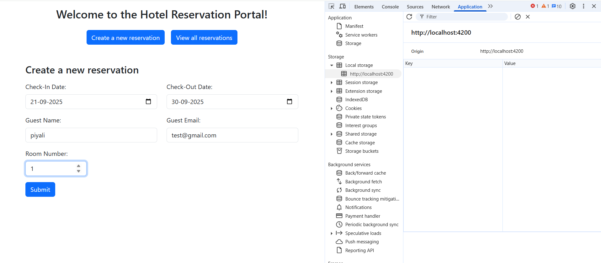
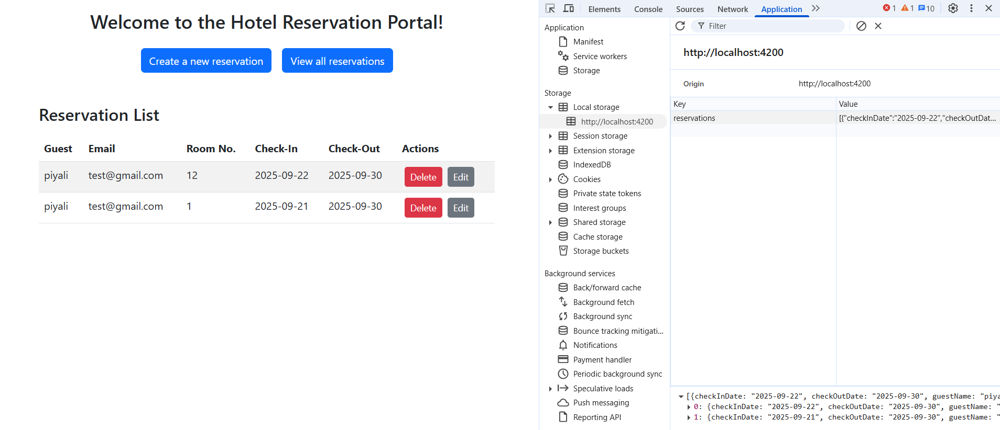

# Angular 19 : Build a Hotel Reservation App with Services, Forms, and Routing

    -   Learn Form validation
    -   Learn service creation
    -   Learn Saving & fetching dat from Localstorage
    -   Learn Routing the application
s

CLick on Create a new reservation, reservation form will open.

after submit, new reservation data is saved in localstorage.
